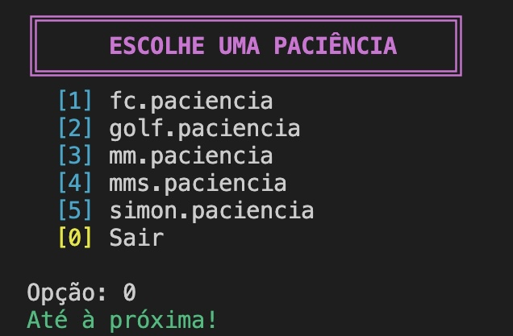
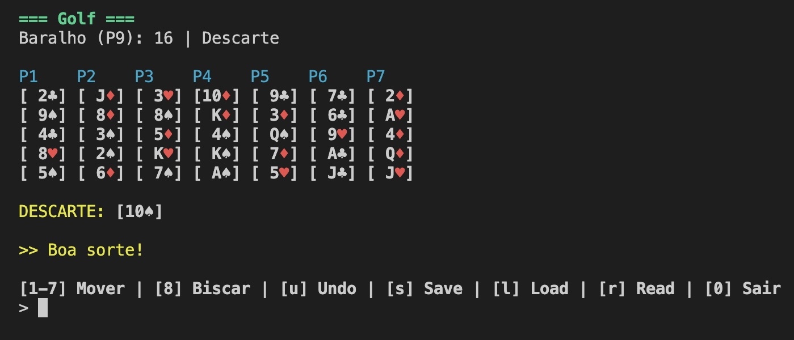
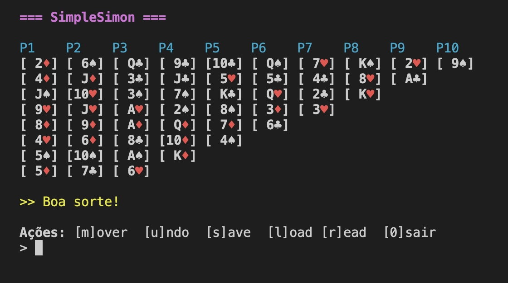

# 🃏 LI2

This project is a C-based implementation of card solitaire games, developed for the Laboratório de Informática II course and evolving into a unified DSL-based patience engine.

```
First phase:  4.3 / 5 ★

Second phase: 3.2 / 5 ★

```

## Build

Run all commands from the `3etapa` directory.

```bash
cd 3etapa
make
```

This will compile the project and generate the executables.

To clean compiled files:

```bash
make clean
```

## Execution Environments

The project supports two main execution environments:

- `./paciencia` - Main solitaire game execution (unified DSL engine)
- `./testes` - Test suite execution

Each one is executed via the terminal, and if required arguments are missing or incorrectly provided, the program will display usage instructions directly in the terminal.

## Screenshots

### Main Menu



### Golf



### Simple Simon



## Project Stages

- `projeto_golf` - Stage 1: Golf Solitaire implementation
- `projeto_simplesimon` - Stage 2: Simple Simon Solitaire implementation
- `3etapa` - Stage 3: Integrated DSL patience engine combining Golf & Simple Simon

## Requirements

Check the `enunciado.md` file in the repository for the full requirements (in Portuguese) of the project.

## 🎴 Authors

Francisco Carvalho - [@xic0z](https://github.com/xic0z)\
Maria\
Miguel
